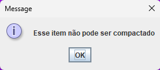

Na opção "QUANTIDADE DE ITENS" você pode ditar "bau" ou "inv". Também pode abreviar... K para mil, M para milhão, B para bilhão, T para trilhão, entre outros.

Bom, eu estou disponibilizando o codigo fonte caso queira analisar, melhorar ou observar

Irei disponibilizar o arquivo para baixar logo a baixo.

**ARQUIVO JÁ COMPILADO** [clique aqui para baixar](NerdCalc.jar)