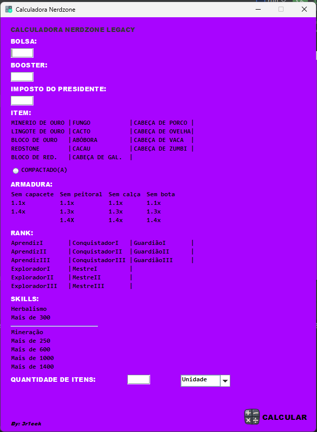
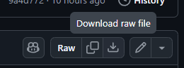

# NerdzoneCalc

Uma calculadora desenvolvida em Java para auxiliar nos cálculos de itens e valores no servidor Nerdzone.



## 📖 Sobre o Projeto

A NerdzoneCalc foi criada para simplificar a vida dos jogadores, automatizando cálculos que normalmente seriam feitos manualmente. A ferramenta oferece uma interface gráfica simples onde o usuário pode inserir informações sobre itens, ranks e habilidades (como mineração e herbalismo) para obter o valor final de forma rápida e precisa.

O código-fonte está disponível para quem desejar analisar, contribuir com melhorias ou simplesmente estudar a implementação.

## ✨ Funcionalidades

- **Cálculo automatizado** para diferentes itens.
- Interface gráfica **simples e intuitiva**.
- **Validações** para prevenir erros de cálculo (ex: tentar compactar um item não compactável).
- Lógica para interpretar **quantidades com sufixos** (K, M, B, etc.).

## 🚀 Como Usar

### Pré-requisitos

- **Java 21** ou superior instalado em sua máquina.

### Instalação

1.  Acesse o link de download: ➡️ **[Baixar NerdzoneCalc.jar](NerdzoneCalc.jar)**
2.  Na página que abrir, clique em **Download** ou **View raw** para baixar o arquivo, como mostrado na imagem abaixo.
    
3.  Após o download, execute o arquivo. Na maioria dos sistemas, basta dar um duplo clique. Se preferir, execute pelo terminal com o comando:
    ```sh
    java -jar NerdzoneCalc.jar
    ```

## 💬 Contato

Se encontrar algum problema, tiver dúvidas ou sugestões, entre em contato comigo pelo [Discord](https://discord.gg/CaJzAqzXkG) (meu usuário é **@3r1cck**).
