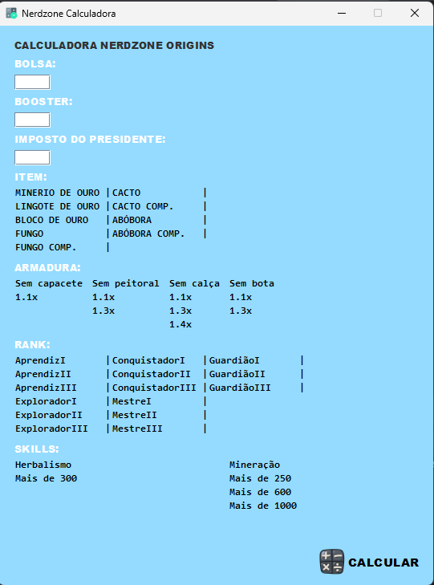

Bom, eu estou disponibilizando o codigo fonte caso queira analisar, melhorar ou observar

Irei disponibilizar o arquivo para baixar logo a baixo.

**ARQUIVO JÁ COMPILADO** [clique aqui para baixar](NerdzoneCalc.jar)