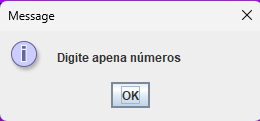

Bom, eu estou disponibilizando o codigo fonte caso queira analisar, melhorar ou observar.

Qualquer duvida pode entrar em contato comigo via [discord](https://discord.gg/CaJzAqzXkG) e me marca @3r1cck.

Irei disponibilizar o arquivo para baixar logo a baixo.

**ARQUIVO JÁ COMPILADO** [clique aqui para baixar](NerdzoneCalc.jar)